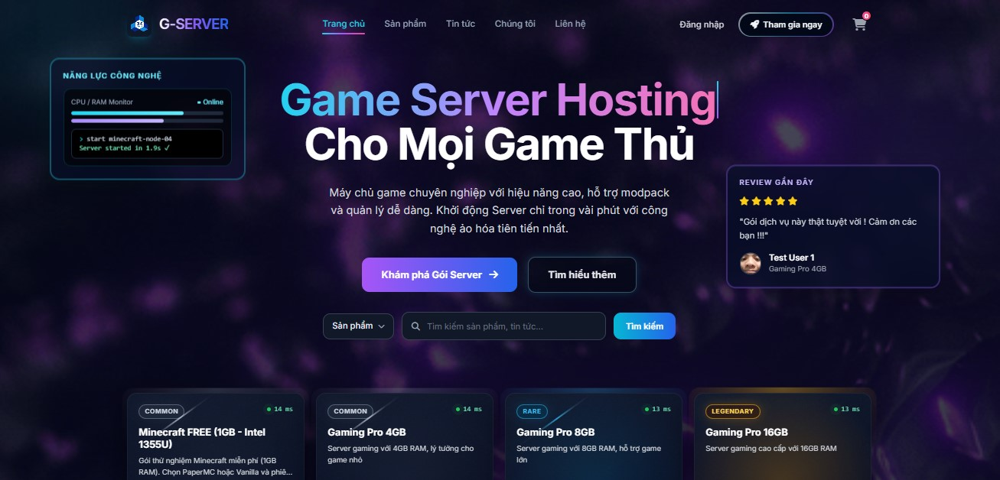
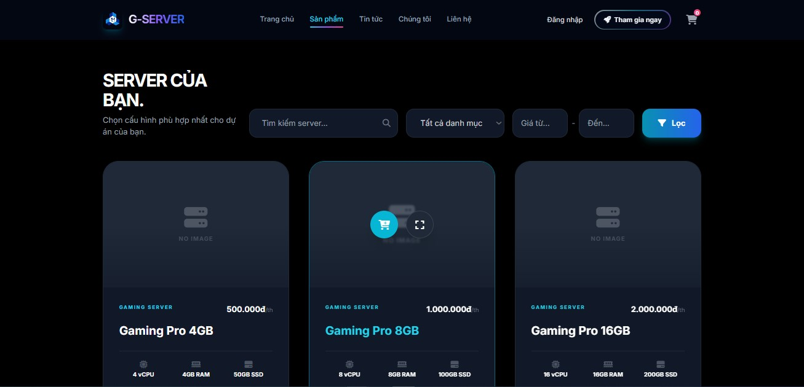
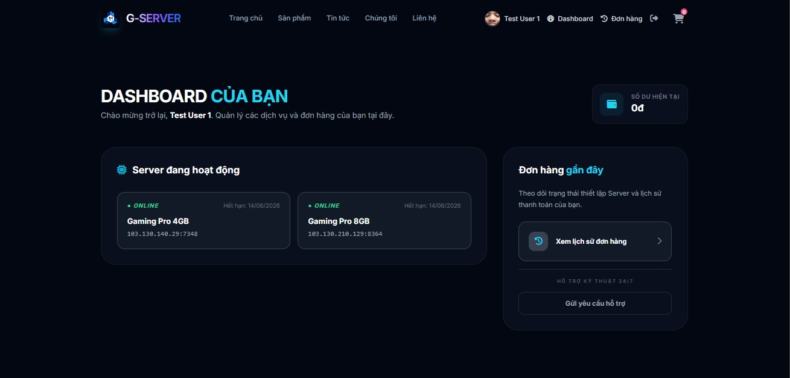
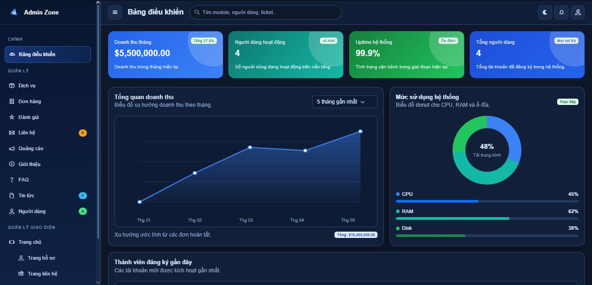
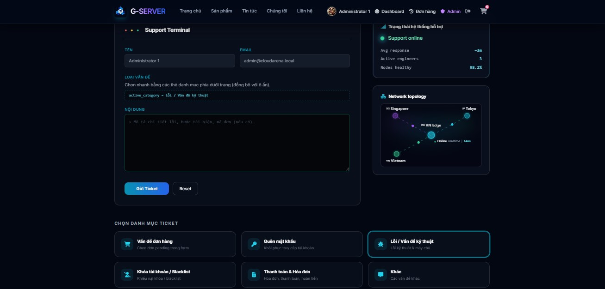

<div align="center">

# SecureHost Arena

### PHP MVC Server Hosting Platform

[](https://www.php.net/)
[](https://www.mysql.com/)
[](https://developer.mozilla.org/)
[](#security-focus)

Security-focused PHP/MySQL web application for managing game server hosting plans, customer orders, support tickets, and admin operations.

</div>

---

## Overview

**SecureHost Arena** is a custom PHP MVC web application that models a game server and web hosting business. It includes a public storefront, customer account area, shopping cart, order workflow, simulated server provisioning, content pages, support tickets, and an admin dashboard.

This repository is tailored as a cybersecurity portfolio project, with emphasis on **web application security**, **secure backend development**, and **blue-team operational workflows** such as user status management, support ticket visibility, order monitoring, and admin notifications.

## Why This Project Matters

This project demonstrates my ability to build and reason about a realistic web application beyond static pages or isolated security labs. It shows how authentication, authorization, database access, file uploads, admin workflows, and user-generated content interact inside a full-stack PHP application.

From a cybersecurity perspective, the project is useful because it contains the same surfaces defenders and application security engineers care about:

- Login, registration, session handling, and role-based access
- User profile updates and password changes
- File upload handling for avatars, branding, and media
- Admin-only CRUD operations
- Search, filtering, pagination, and database-backed views
- Support tickets and status-driven operational workflows
- Order processing and simulated service provisioning

## Core Features

### Public Website

- Homepage, about page, FAQ page, contact page, products, and news/blog
- Game server and web hosting plan catalog
- Product categories, search, price filtering, and pagination
- Product detail pages with reviews and related services
- SEO-friendly public routes, sitemap, and robots output

### Customer Area

- User registration and login
- Profile management with avatar upload
- Password update flow
- Shopping cart and checkout
- Order history and order detail pages
- Simulated active server services with IP address, port, RAM, and expiration data

### Admin Dashboard

- Dashboard metrics for users, services, orders, revenue, and tickets
- Product and hosting package management
- Order management and service provisioning workflow
- User management with role and status controls
- Contact and support ticket management
- FAQ, about page, news/blog, comments, reviews, ads, and public settings management
- Admin notification badges and toast-style alerts for operational visibility

## Screenshots

### Public Homepage


### Hosting Plans


### Customer Dashboard


### Admin Dashboard


### Support Ticket Triage


## Security Focus

The application includes several security-oriented controls and implementation choices:

- **PDO prepared statements** through a database wrapper to reduce SQL injection risk
- **CSRF token generation and verification** for sensitive form flows
- **Password hashing and verification** using PHP password APIs
- **Session regeneration after login** to reduce session fixation risk
- **Role-based access checks** for admin-only controllers
- **User status controls** for active and banned accounts
- **Secure upload handling** with size limits, MIME detection, image validation, randomized filenames, and SVG sanitization
- **Output escaping** in user-facing views where dynamic content is rendered
- **Protected application structure** with public entry point separation from application logic
- **Safer error handling** for database connection failures without exposing raw stack traces to users

## Blue-Team Relevance

While this is not a SIEM or SOC platform, the project is designed around workflows that map well to blue-team thinking:

- Admin notification summaries for newly created tickets and completed orders
- Ticket statuses for triage and follow-up
- User account status management for abuse handling
- Order and service status tracking
- Operational dashboard metrics for quick situational awareness
- Structured database records that could be extended into audit logs, alerts, or incident timelines

## Tech Stack

| Area | Technology |
| --- | --- |
| Backend | PHP 8.2+ |
| Architecture | Custom MVC |
| Database | MySQL |
| Database Access | PDO |
| Frontend | HTML5, CSS3, JavaScript |
| Styling | Custom CSS, Tailwind-style utility classes, Bootstrap-based admin assets |
| Local Runtime | XAMPP, WampServer, MAMP, or Apache/PHP/MySQL |

## Architecture

The application follows a custom MVC structure:

```text
Browser request
    -> public/index.php
    -> app/core/App.php router
    -> Controller action
    -> Model and Database layer
    -> View rendered as HTML
```

Repository structure:

```
SecureHost-Arena-PHP-MVC-Server-Hosting-Platform/
├── app/
|   ├── config/          # Environment loading and app configuration
|   ├── controllers/     # Public, user, cart, product, post, and admin controllers
|   ├── core/            # Router, base controller, database wrapper, secure upload helper
|   ├── helpers/         # Session, pagination, and upload helpers
|   ├── models/          # Database models for users, products, orders, tickets, content
|   ├── views/           # Client and admin PHP views
├── public/
|   ├── css/             # Client styles and visual assets
|   ├── js/              # Client scripts
|   ├── admin_assets/    # Admin dashboard CSS, JS, fonts, and images
|   ├── uploads/         # Runtime upload directory
|   ├── index.php        # Public entry point
├── database.sql         # Database schema and seed data
└── README.md
```

## Database Model

Important tables include:

- `users` - customer and admin accounts, roles, status, profile data, credit balance
- `products` - hosting plans with RAM, CPU, disk, price, and status
- `categories` - product/service categories
- `carts` and `cart_items` - customer cart workflow
- `orders` and `order_items` - order and checkout records
- `user_services` - simulated provisioned hosting services
- `contacts` - support ticket and contact messages
- `news`, `news_categories`, `reviews`, `news_views`, `news_likes` - content and engagement features
- `settings` - public branding and configurable site content
- `admin_notifications` - admin-facing operational notification data

## Local Setup

### Requirements

- PHP 8.2 or newer
- MySQL
- Apache with `mod_rewrite` enabled
- XAMPP, WampServer, MAMP, or equivalent local stack

### Installation

1. Clone the repository into your web server directory.

```bash
git clone <repository-url>
```

2. Create a MySQL database.

```sql
CREATE DATABASE securehost_arena CHARACTER SET utf8mb4 COLLATE utf8mb4_unicode_ci;
```

3. Import the clean demo schema and seed data.

```bash
mysql -u root -p securehost_arena < database.sql
```

The SQL file is a public-safe demo installer. It keeps the application schema and minimal sample records, but avoids real personal data, raw runtime logs, and destructive database-level drop commands.

4. Configure environment variables in `.env`.

```env
DB_HOST=localhost
DB_PORT=3306
DB_USER=root
DB_PASS=
DB_NAME=securehost_arena
URLROOT=http://localhost/SecureHost-Arena-PHP-MVC-Server-Hosting-Platform
SITENAME=SecureHost Arena
```

5. Start Apache and MySQL, then open the application in your browser.

```text
http://localhost/SecureHost-Arena-PHP-MVC-Server-Hosting-Platform
```

Admin route:

```text
http://localhost/SecureHost-Arena-PHP-MVC-Server-Hosting-Platform/admin
```

Demo accounts are for local development only:

| Role | Username | Password |
| --- | --- | --- |
| Admin | `admin` | `ChangeMe123!` |
| Member | `demo_user` | `DemoUser123!` |

Change the seeded passwords before deploying or recording a public demo.

## Portfolio Positioning

This project is positioned for roles and internships related to:

- Web application security
- Secure backend development
- Application security engineering
- Blue-team operations
- SOC-adjacent web monitoring and incident triage workflows
- DevSecOps fundamentals for PHP/MySQL applications

## Future Improvements

Security and blue-team improvements planned or suitable for future work:

- Centralized audit logging for admin actions
- Failed login tracking and rate limiting
- Security event dashboard for authentication, upload, and admin events
- Stronger authorization policy layer
- Automated security tests for common OWASP Top 10 risks
- Content Security Policy and security headers
- Docker-based local environment
- CI checks for PHP syntax, dependency review, and static analysis
- Real server provisioning integration with safer queue-based execution

## Security Notice

This project is intended for learning, portfolio demonstration, and local development. Before production use, it would require additional hardening such as HTTPS enforcement, secret rotation, rate limiting, structured audit logs, backups, monitoring, dependency review, and deployment-specific security configuration.

## Credits

This repository is presented as my personal portfolio version of an academic web programming project. The original project was developed with team collaboration and contributions from:

- Giang (@menotliam)
- Bao   (@BaoBao137)
- Thien (@tranducthien2701)
- Khoa (@khoadangnguyenn)

## License

This project is released under the license included in this repository.
